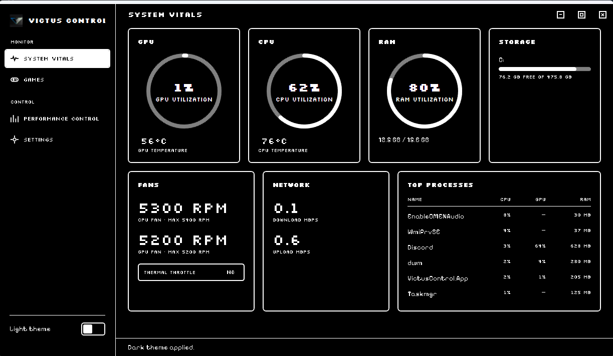
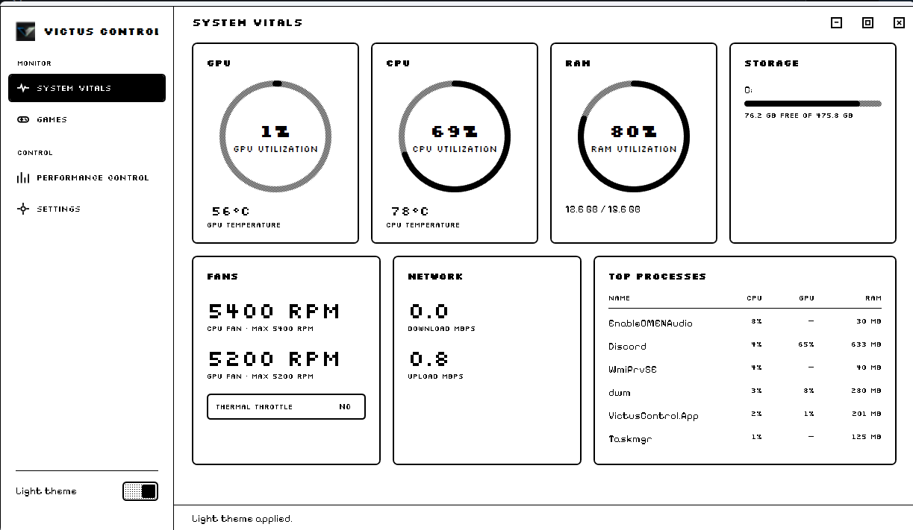
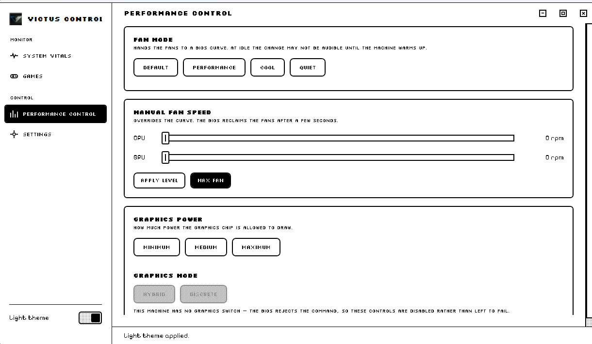
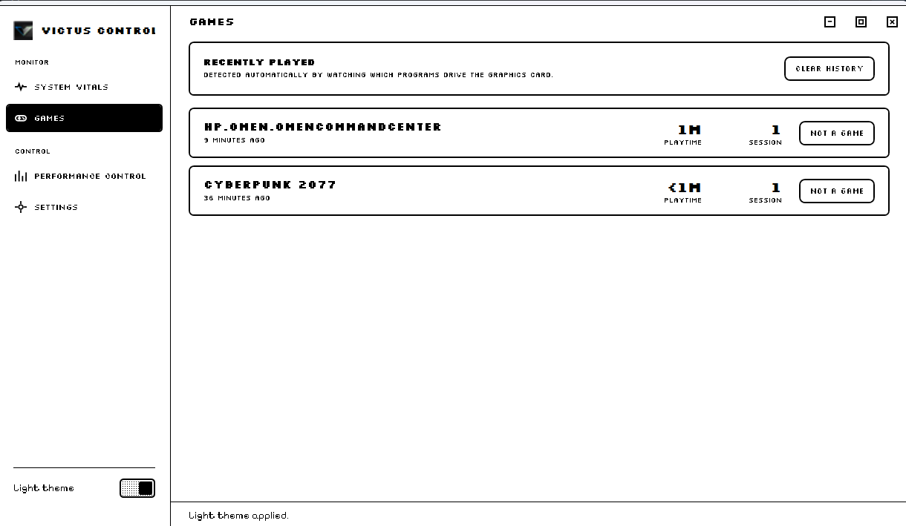

# Victus Control

Victus Control is a Windows desktop application for HP Victus and Omen laptops. It gives you direct access to fan and performance controls from the HP BIOS and WMI surface, without the ads, account requirements, and background overhead of Omen Gaming Hub.

## What it does

Victus Control helps you:

- Monitor CPU, GPU, memory, storage, network, and fan status in real time
- Adjust fan modes and fan levels where supported
- Toggle performance related actions such as max fan behavior
- Keep the app available from the system tray for quick access
- Show unsupported features clearly instead of pretending they work

## Requirements

- Windows 11
- .NET 8 SDK
- Administrator privileges for fan and power controls
- NVIDIA driver for GPU telemetry

## Build and run

From the repository root, run:

```powershell
dotnet build VictusControl.sln
```

You can also open the solution in Visual Studio 2022 or later and build or run it from there.

## Project structure

- src/VictusControl.App: WPF user interface and system tray integration
- src/VictusControl.Core: BIOS access, monitoring, and game tracking logic
- src/VictusControl.Diag: diagnostic tool for probing hardware capabilities

## Screenshots









## Notes

This project targets Windows desktop and uses WPF for the interface. Some controls depend on the laptop hardware and BIOS support. When something is unavailable, the app reports that state instead of offering a misleading control.

## License

This project is distributed under the GPL 3.0 license. See THIRD_PARTY_NOTICES.md for additional third party attribution.
